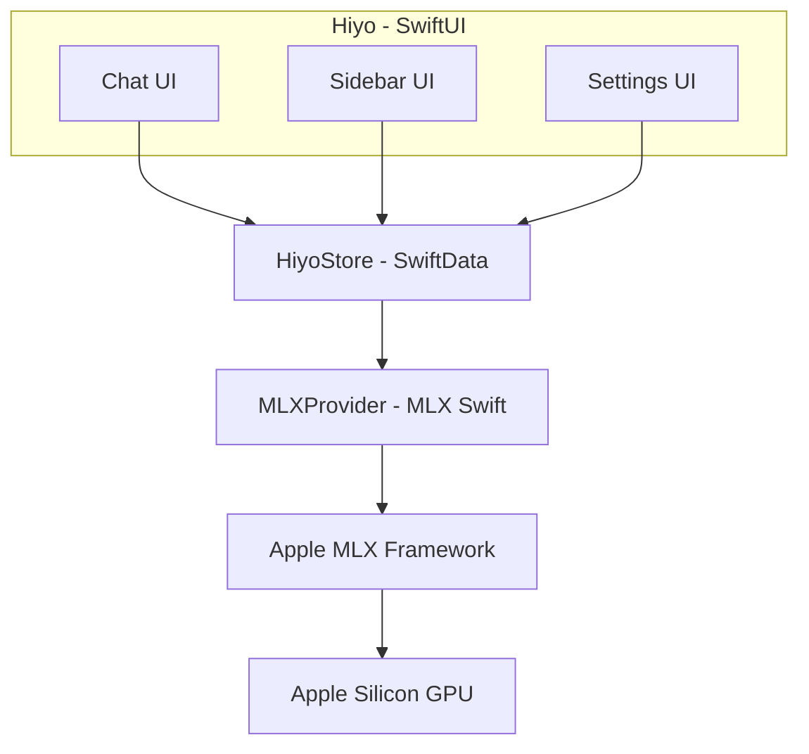

<p align="center">
  
</p>

<h1 align="center">Hiyo</h1>
<p align="center"><strong>Local Intelligence Powered by You</strong></p>
<p align="center">
  <a href="#download"></a>
  <a href="#build"></a>
  <a href="LICENSE"></a>
</p>

---

## Overview

**Hiyo** is your personal gateway to local AI — a sleek macOS app that brings powerful language models right to your desktop, no cloud required. Built on Apple's native **MLX framework**, Hiyo delivers exceptional performance on Apple Silicon while keeping everything private and on-device.

Whether you're a developer, researcher, or just curious about AI, Hiyo makes it easy to explore complex ideas with clarity and control. No logins, no data sharing, no internet connection — just fast, focused intelligence that works the way you do.

With Hiyo, you're not just using AI — you're shaping it.

---

## ✨ Why Hiyo?

| Feature | Benefit |
|---------|---------|
| 🚀 **Apple Silicon Native** | Built on MLX for up to 2x faster inference vs CPU |
| 🧠 **Unified Memory** | GPU and CPU share memory — no data copying overhead |
| 🔒 **100% Private** | Everything runs locally. Zero network calls. Zero data sharing. |
| ⚡ **Instant On** | No servers to start. Models load directly into memory. |
| 🎯 **Curated Models** | Pre-configured with optimized 4-bit quantized models |
| 🛡️ **Enterprise Security** | Sandboxed, hardened runtime, code-signed, encrypted storage |

---

## System Requirements

| Requirement | Details |
|-------------|---------|
| **macOS** | 14.0 (Sonoma) or later |
| **Chip** | Apple Silicon (M1/M2/M3) or Intel |
| **RAM** | 8 GB minimum, 16 GB recommended |
| **Storage** | 2 GB for app, 2-8 GB per model |
| **Xcode** | 15.0+ (for building from source) |

> **Note**: MLX-optimized models run best on Apple Silicon. Intel Macs supported with reduced performance.

---

## 🚀 Quick Start

### Option 1: Download Pre-built DMG

1. Download `Hiyo-1.0.0.dmg` from [Releases](https://github.com/hiyoai/hiyo/releases)
2. Open DMG and drag **Hiyo** to **Applications**
3. Launch Hiyo from Applications folder
4. On first launch, select a model to download (1-4 GB)
5. Start chatting!

### Option 2: Build from Source

See [BUILD_APP.md](BUILD_APP.md) for detailed instructions.

```bash
# Quick build
git clone https://github.com/hiyoai/hiyo.git
cd hiyo
swift build -c release
```

---

## 🏗️ Architecture

Hiyo is built on a modern, secure architecture:



---

## 🧠 Included Models

Hiyo comes pre-configured with these optimized models:

| Model | Size | Best For |
|-------|------|----------|
| **Llama 3.2 1B** | 0.7 GB | Ultra-fast responses, low memory |
| **Llama 3.2 3B** ⭐ | 1.9 GB | Best balance of speed and quality |
| **Mistral 7B** | 4.1 GB | Advanced reasoning, complex tasks |
| **Phi-3 Mini** | 1.8 GB | Efficient, strong performance |
| **Qwen 2.5 7B** | 4.2 GB | Multilingual, coding |
| **CodeLlama 7B** | 4.1 GB | Code generation, technical tasks |

All models are **4-bit quantized** from the [MLX Community](https://huggingface.co/mlx-community) on Hugging Face.

---

## 🔒 Security & Privacy

Hiyo implements **defense-in-depth security**:

| Layer | Implementation |
|-------|---------------|
| **Sandbox** | Strict macOS App Sandbox |
| **Code Signing** | Hardened Runtime with integrity checks |
| **Network** | **Zero** network connections — fully offline |
| **Storage** | AES-256 encrypted local database |
| **Memory** | Secure memory with automatic wiping |
| **Input** | Strict validation and sanitization |

### Privacy Guarantees

- ✅ No cloud processing
- ✅ No telemetry or analytics
- ✅ No user accounts or tracking
- ✅ No iCloud sync
- ✅ Models cached locally only

---

## 🛠️ Development

### Project Structure

```
Hiyo/
├── Package.swift                 # Swift Package Manager manifest
├── Sources/Hiyo/
│   ├── HiyoApp.swift            # App entry point
│   ├── ContentView.swift        # Main UI layout
│   ├── HiyoState.swift          # Global state
│   ├── Core/                    # Business logic
│   │   ├── HiyoStore.swift      # Data persistence
│   │   ├── MLXProvider.swift    # MLX integration
│   │   ├── MLXModelRegistry.swift
│   │   └── Models/              # Chat, Message
│   ├── Security/                # 9 security modules
│   ├── UI/                      # SwiftUI views
│   └── Utils/                   # Extensions, constants
├── Tests/                       # Unit & UI tests
└── Assets/                      # Icons, images
```

### Key Technologies

- **[MLX Swift](https://github.com/ml-explore/mlx-swift)** — Apple's machine learning framework
- **[SwiftData](https://developer.apple.com/documentation/swiftdata)** — Modern persistence
- **[SwiftUI](https://developer.apple.com/documentation/swiftui)** — Native UI framework
- **[CryptoKit](https://developer.apple.com/documentation/cryptokit)** — Encryption

### Building

```bash
# Clone
git clone https://github.com/hiyoai/hiyo.git
cd hiyo

# Resolve dependencies
swift package resolve

# Build debug
swift build

# Build release
swift build -c release

# Run tests
swift test

# Create Xcode project
swift package generate-xcodeproj
```

See [BUILD_APP.md](BUILD_APP.md) for complete DMG creation guide.

---

## 🎮 Usage

### Keyboard Shortcuts

| Shortcut | Action |
|----------|--------|
| `⌘ N` | New conversation |
| `⌘ ⇧ N` | New window |
| `⌘ ⇧ K` | Clear current conversation |
| `⌘ E` | Export conversation |
| `⌘ ,` | Settings |
| `⌘ ⌫` | Delete selected conversation |
| `⌘ ↵` | Send message |

### Tips

- **First launch**: Download a smaller model (1B or 3B) to test
- **Memory pressure**: Unload unused models in Settings
- **Long conversations**: Clear history periodically to free context window
- **Export**: Conversations export as encrypted `.hiyo` files

---

## 🤝 Contributing

We welcome contributions! Please see [CONTRIBUTING.md](CONTRIBUTING.md).

```bash
# Fork and clone
git clone https://github.com/yourusername/hiyo.git

# Create branch
git checkout -b feature/amazing-feature

# Make changes, test, commit
swift test
git commit -m "Add: amazing feature"

# Push and open PR
git push origin feature/amazing-feature
```

### Areas for Contribution

- [ ] Additional MLX model support
- [ ] Conversation search
- [ ] Markdown rendering improvements
- [ ] Voice input/output
- [ ] Plugin system
- [ ] Localization

---

## 📚 Documentation

- [BUILD_APP.md](BUILD_APP.md) — Complete build instructions
- [CONTRIBUTING.md](CONTRIBUTING.md) — Contribution guidelines
- [SECURITY.md](SECURITY.md) — Security architecture details
- [API.md](API.md) — Internal API documentation

---

## 🙏 Acknowledgments

- **[MLX](https://github.com/ml
